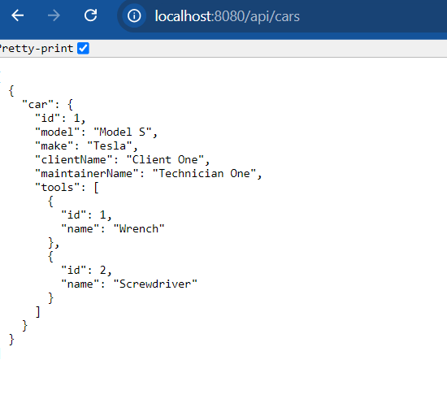

# Car Service REST API sample

## Overview

The **Car Service REST API** 🚗🧑‍🔧  offers a comprehensive solution for managing car service systems. This developer-friendly project is designed to enhance proficiency with modern Spring applications, providing hands-on experience with real-world scenarios and best practices for backend development.

**Goals** :

- Enhance problem-solving skills by tackling real-world challenges.
- Gain hands-on experience in modern web backend development.
- Improve proficiency in Java and related frameworks.
- Master Git for version control, including branching and merging.
- Learn to effectively use GitHub for repositories, issues, pull requests, and discussions.
- Develop skills in documentation and testing.
- And more!

## Features

- **Expose Cars data**: Retrieve detailed information about cars, including related entities like clients, maintainers, and tools.
- **Custom JSON structure**: Generate JSON responses with a custom JSON builder, maintaining the order of attributes.

## Technology Stack

- **Framework**: [Spring Boot](https://docs.spring.io/spring-boot/index.html) v3.2 (Spring v6)
- **Languages**: Java v17
- **Build Tool**: [Maven](https://maven.apache.org/) v3.9
- **Code Formatting**: [Checkstyle](https://checkstyle.sourceforge.io/) and [Spotless](https://github.com/diffplug/spotless)
- **Version Control**: Git

## Getting Started

### Installation

1. **Clone the repository**

```bash
git clone <GITHUB_REPOSITORY_URL>
cd car-service-rest-api
```

2. **Build**
```bash 
./mvnw clean install
```

3. **Run**
```bash
./mvnw spring-boot:run "-Dspring-boot.run.profiles=demo"
```
_Note: Currently, the app doesn't have endpoints for CRUD operations yet (except one `GET/api/cars`). The `demo` profile refers to `../configs/LoadDatabase`, which helps to fill database with some data at runtime._

4. **Check Endpoint**:

From Web-browser (or Postman) check the following URL `http://localhost:8080/api/cars` with `GET` HTTP method :



5. **Check Database**:

We use [H2 Database](https://www.h2database.com/html/main.html) to demonstrate the app while in DEV mode. SpringBoot autoconfigures H2 database :

Check the app's log, make sure to have something like this :
```bash
INFO ... Added connection conn0: url=jdbc:h2:mem:a917d8a4-bb16-46a1-84a4-f59d60f01ca8 user=SA
INFO ... H2 console available at '/h2-console'. Database available at 'jdbc:h2:mem:a917d8a4-bb16-46a1-84a4-f59d60f01ca8'
```

Next, from web-browser, try the following URL : `http://localhost:8080/h2-console`. This will take you to H2 console webpage: 


Copy, paste your database URL and username from your app's log and press on `Connect` button :


## Code Quality and Maintenance

To maintain a consistent code style and ensure high code quality, we have integrated several tools and practices into our project:

### Code Formatting

1. **Spotless**: Ensures that the code adheres to defined formatting rules. Spotless helps keep the codebase clean and uniformly formatted.

2. **Checkstyle**: Assists in writing code that conforms to Java standard coding practices. It enforces a set of coding standards and helps maintain good quality.

_Note: If you're new to these tools, there’s no need to worry. They are already configured and will work seamlessly in the background._

### Git Hooks

To ensure code quality and proper branching, we use Git hooks managed by the [**Git Build Hook Maven Plugin**](https://github.com/rudikershaw/git-build-hook). This plugin facilitates the management of hook scripts (check `./configs/git-hooks/pre-commit` file). 

This technique helps prevent poorly formatted or non-compliant code from being committed or pushed.

Currently, there are 2 sorts of hooks :
1. **Pre-commit**: Automatically format code and run checks before allowing a commit. If issues are found, the commit will be aborted until the issues are resolved.

2. **Pre-push**: (check the [next section](#branch-naming-convention))

### Branch Naming Convention
To maintain clarity and consistency, we follow a structured branch naming convention. A pre-push Git hook is in place to enforce this convention (check `./configs/git-hooks/pre-push` file).
