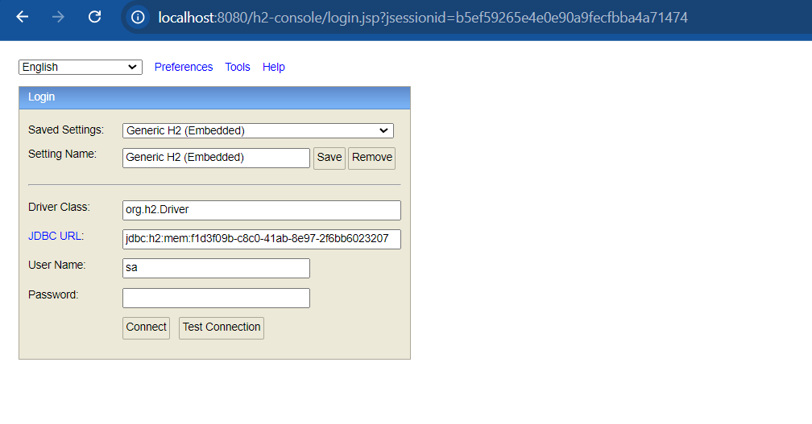
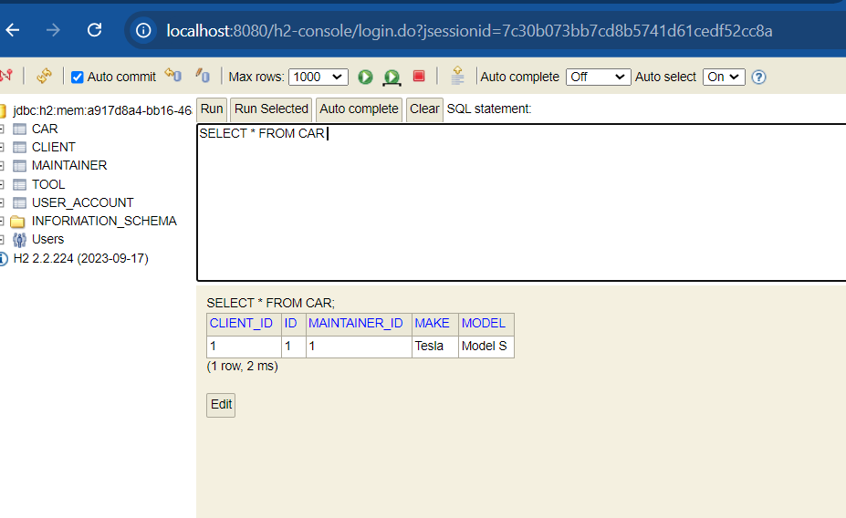

# Car Service REST API sample

[](https://github.com/firasrg/car-service-rest-api/actions/workflows/code-analysis.yaml)
[](https://img.shields.io/badge/Java-17-f0fc03)

[](https://sonarcloud.io/summary/new_code?id=firasrg_car-service-rest-api)
[](https://sonarcloud.io/summary/new_code?id=firasrg_car-service-rest-api)
[](https://sonarcloud.io/summary/new_code?id=firasrg_car-service-rest-api)
[](https://sonarcloud.io/summary/new_code?id=firasrg_car-service-rest-api)

## Overview

The **Car Service REST API** 🚗🧑‍🔧  offers a comprehensive solution for managing car service systems. This developer-friendly project is designed to enhance proficiency with modern Spring applications, providing hands-on experience with real-world scenarios and best practices for backend development.

**Goals** :

- Enhance problem-solving skills by tackling real-world challenges.
- Gain hands-on experience in modern Web Applications.
- Improve proficiency in Java and related frameworks.
- Learn how to effectively use [GitHub](https://github.com/).
- Develop skills in documentation and testing.

## Features

- **Expose Cars data**: Retrieve detailed information about cars, including related entities like clients, maintainers, and tools.
- **Custom JSON builder**: Generate JSON responses with a customizable JSON builder component.

## Technology Stack

- **Framework**: [Spring Boot](https://docs.spring.io/spring-boot/index.html) v3.2 (Spring v6)
- **Languages**: Java v17
- **Build Tool**: [Maven](https://maven.apache.org/) v3.9
- **Code Formatting**: [Checkstyle](https://checkstyle.sourceforge.io/) and [Spotless](https://github.com/diffplug/spotless)
- **Version Control**: Git

## Getting Started

1. **Clone the repository**

```bash
git clone <GITHUB_REPOSITORY_URL>
cd car-service-rest-api
```

2. **Build**
```bash 
./mvnw clean install
```

3. **Run**
```bash
./mvnw spring-boot:run "-Dspring-boot.run.profiles=demo"
```
_Note: Currently, the app doesn't have endpoints for CRUD operations yet (except one `GET/api/cars`). The `demo` profile refers to `../configs/LoadDatabase`, which helps to fill database with some data at runtime._

4. **Check Endpoint**:

From Web-browser (or Postman) check the following URL `http://localhost:8080/api/cars` with `GET` HTTP method :


5. **Check Database**:

We use [H2 Database](https://www.h2database.com/html/main.html) to demonstrate the app while in DEV mode. SpringBoot autoconfigures H2 database :

Check the app's log, make sure to have something like this :
```bash
INFO ... Added connection conn0: url=jdbc:h2:mem:a917d8a4-bb16-46a1-84a4-f59d60f01ca8 user=SA
INFO ... H2 console available at '/h2-console'. Database available at 'jdbc:h2:mem:a917d8a4-bb16-46a1-84a4-f59d60f01ca8'
```

Next, from web-browser, try the following URL : `http://localhost:8080/h2-console`. This will take you to H2 console webpage: 



Copy, paste your database URL and username from your app's log and press on `Connect` button :



There you go 🎉!

## Contributing 

If you want to dive in this project and help us to improve it, please read and follow our [contributing guidelines](./CONTRIBUTING.md).

## Community
You can join us on [Together Java Discord server](https://discord.com/channels/272761734820003841/1265407633758883870): brainstorm ideas, ask questions, and collaborate with others. Be respectful and follow the server guidelines. We have a dedicated channel for this project.
