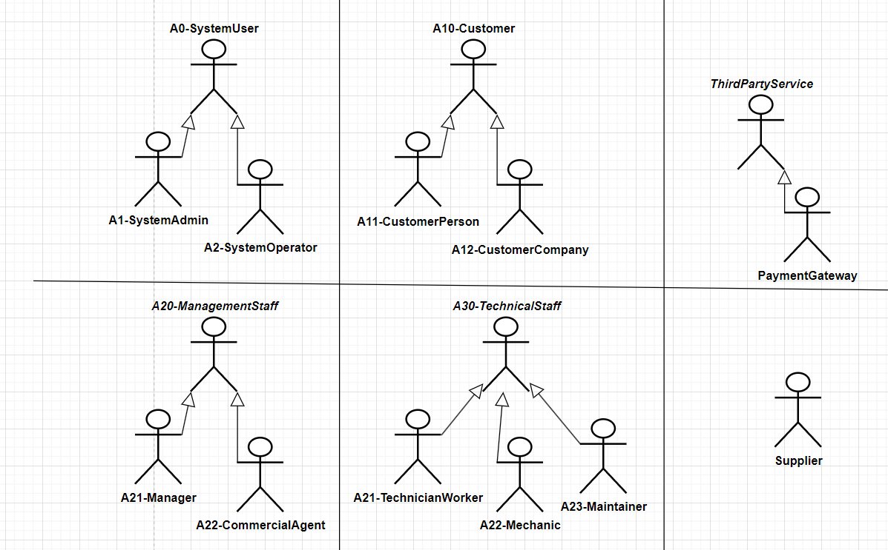

# Car Services System - Modeling and Design

In this section, we translate the project's [main business components](./overview.md#system-business-components) into documented actors, use cases, and diagrams. By following UML standards.

## Actors
Various actors interact with the system to perform different tasks. These actors are classified into groups based on their roles and responsibilities within the system. Below is a diagram that visually represents all the actors :

NOTE⚠️: _You may have noticed that actor names have prefixes (like `A0` or `A20`), this technique is useful to mark actors and remember them shortly. This is useful as actor names may change in the future. So using that prefix is like a unique identifier for each actor._
